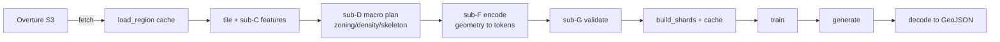
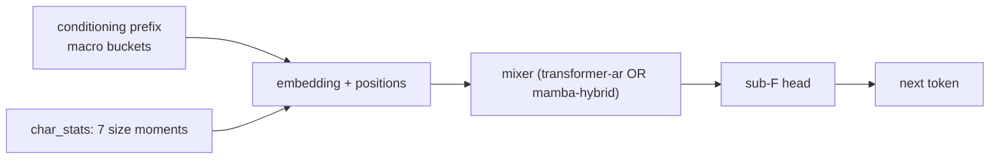

# Bonzai-OSM — project overview

A from-scratch explainer. Every number is sourced to `docs/GROUND_TRUTH.md` (GT) or code;
where something is unknown it says so. No marketing.

## What this is

Bonzai-OSM is a **generative model for city geometry**. Like a language model emits sentences
token by token, this model emits a **map cell** — its roads, buildings, POIs, and land use — as a
sequence of discrete tokens, then those tokens are decoded back into geometry (GeoJSON). The
target user is a **simulation engineer** (AV/robotics): the bar is **plausible, geometrically
valid** output, *not* photo-real or distributionally exact (memory `project_v1_persona`).

A **cell** is a small square patch of the world; a **tile** is a grid of cells; a **token** is one
symbol in the geometry vocabulary.

## 1. Data source → cleaning → what's used

Source is **Overture Maps** (open, S3-hosted map data). We pull European cities, slice each into
tiles, and keep four feature classes per cell: **buildings** (footprint polygons), **roads**
(lines), **POIs** (points), **land use / base** (areas).

Cleaning is staged and gated: per-tile derivation (sub-C/sub-D), then a **validator** (sub-G) that
rejects malformed tiles; a known **degraded-source** pair (rotterdam/warsaw) was repaired and
re-admitted (scripts/multiregion). The result is the **`eu-train-union`** corpus: **42 cities,
≈623.9M tokens** (`TRAIN_TOKENS = 623_900_790`, GT §3). Four cities are **held out** from training
for evaluation — **glasgow, eisenhüttenstadt, munich, krakow** (GT §3).



## 2. Tokenization — the sub-F grammar (v1)

Geometry is turned into tokens by a **sealed grammar** (`src/cfm/data/sub_f`). A cell is split into
**feature blocks**, one per building/road/POI. Each block is an **anchor** (a quantized start
point) plus a walk of **(direction, magnitude)** steps that trace the shape; the magnitude quantum
is **0.5 m** (`DEFAULT_MAGNITUDE_QUANTUM_M`, `src/cfm/data/sub_f/encoder.py`). A building is the same
anchor+walk whose ring returns to its start. The model's sub-F vocabulary spans **1508 token ids**
(`subf_vocab_size()` = max sub-F id + 1, measured; **687** distinct live tags over a sparse id
space). A special **`<cell_end>` token (id 260)** marks the end of a cell so generation
**self-terminates** (cell-EOS spec).

```mermaid
flowchart LR
  cell[cell geometry] --> blocks[feature blocks]
  blocks --> anc[anchor] --> walk["(dir, mag) steps"] --> tok[token stream]
  tok --> end["&lt;cell_end&gt; (260)"]
```

Two important grammar facts (this session): closure is expressed only **to quantization
precision** (no exact-equality guarantee), and there is **no junction/shared-vertex primitive** —
each feature is encoded independently; the only cross-feature link (`<bref>`) points at the **cell
boundary** and drops its position (≤125 m error). These explain the validated results below.

## 3. Model architecture

A **hierarchical autoregressive** model: it predicts the next token given all previous tokens,
preceded by a **conditioning prefix**. Two interchangeable **backbones** share everything except
their sequence mixer (`src/cfm/models/scaffold_backbone.py`):

- **`transformer-ar`** — causal self-attention (d512 / 14 layers, 52.8M params, GT §4).
- **`mamba-hybrid`** — a state-space (Mamba) scan with attention every 7th layer (a "1:7 Jamba",
  d512 / 24 layers, 53.7M params, GT §4).

Both are **~53M parameters**, deliberately param-matched (≤2%) so a comparison isolates the
backbone. The shared scaffold: a token **embedding**, an additive **positional** embedding, the
**conditioning prefix** (9 value-bearing ids: zoning, road-skeleton, density, coastal, city, …),
a **character-stats carrier** (one prefix slot whose embedding is a projection of 7 continuous
building/road size moments — `value-char-v1`), and a **sub-F-range output head**.



## 4. Training setup

PyTorch **Lightning**, **4× A100 DDP**, **bf16**, on **CINECA Leonardo** (EuroHPC). Sequence unit =
one cell (`[conditioning prefix | cell tokens]`); next-token cross-entropy is computed on the cell
body only (prefix masked). The locked bake-off trained a **6-run matrix** — 2 backbones × 3 seeds
(7/13/23) — to **~112k steps** on `eu-train-union` (GT §4; the **training** matrix is COMPLETED —
the *eval* matrix is separate, memory `project_lane_s_sampler_state`). Compute is charged to grant `AIFAC_P02_548` = **5,000 GPU-h**
(= 1,250 node-h = 40,000 core-h; GT §1).

## 5. What's validated so far

Methodology validation is the **current focus** (`docs/PROJECT_FOCUS.md`) — *does the pipeline
produce coherent geometry?*, **not** a realism or architecture verdict:

- **Tokenization round-trips** and **training converges**.
- Generation is **conditioning-responsive** (denser context → more buildings/roads), **100%
  decodable**, and **self-terminating** (21/21 probe cells emit `<cell_end>`).
- **Buildings are coherent** — sane footprints; most are near-closed (seal to ~1 quantum).
- **Roads are geometry, not topology** — the segments are plausible but **fragmented** (they do not
  share junction vertices), because v1 has no junction primitive.

## 6. What's deferred (not bugs in the model unless noted)

- **(a)** an over-strict exact ring-closure check in the **eval** suppresses ~half of building
  promotion (a metric bug, not the model).
- **(b)** a modest building **closing-precision** gap (~1 quantum) — small training-precision item.
- **(c)** **road topology** — a **v1 representation gap**; connected roads can't be expressed in v1,
  so deferred to a v2 grammar.
- The **char_stats↔KS realism echo** is parked; the **transformer-vs-mamba crown** is deferred
  (a standing eval harness exists; the 6-way run is not yet concluded). (PROJECT_FOCUS.)

## 7. What is NOT known

Whether the output is **distributionally realistic** (held-out realism eval not concluded);
whether **more training** would materially help; whether either backbone wins (**no decisive
verdict** taken). Those are open by design at this stage.
