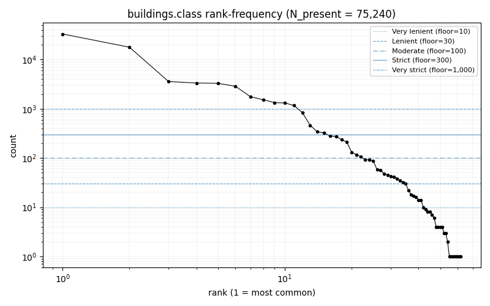
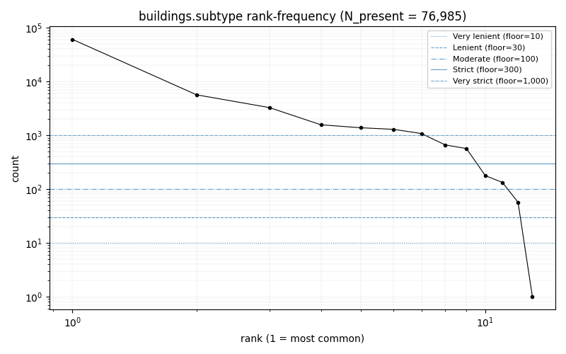
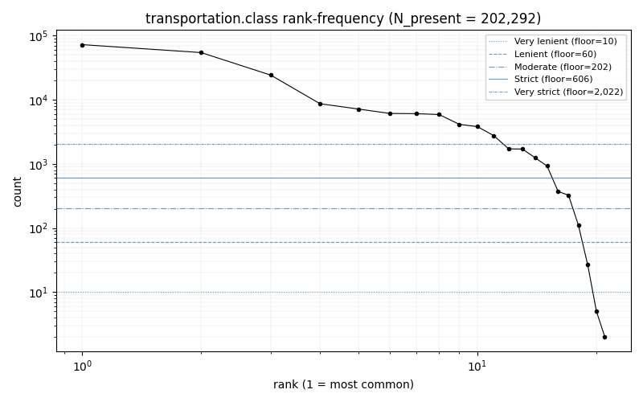
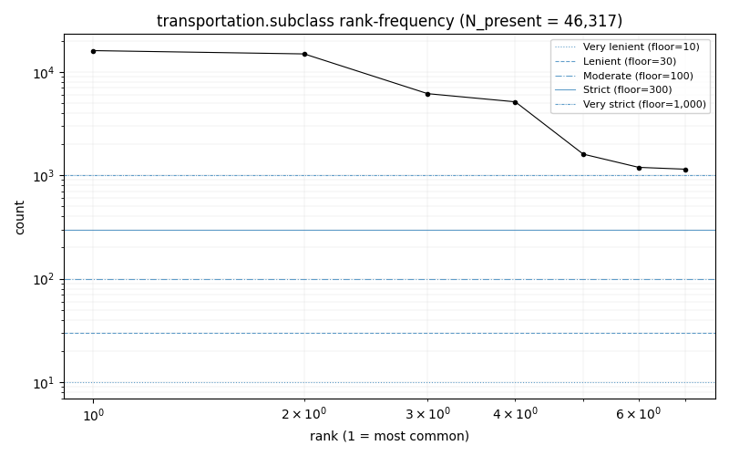
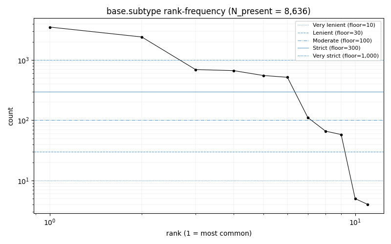
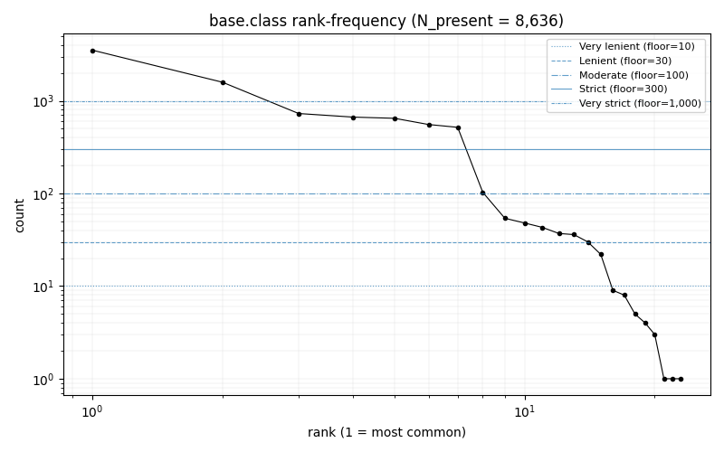
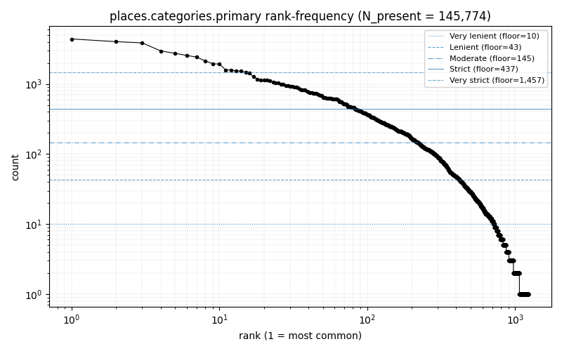
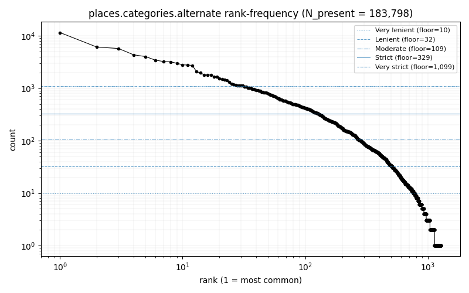
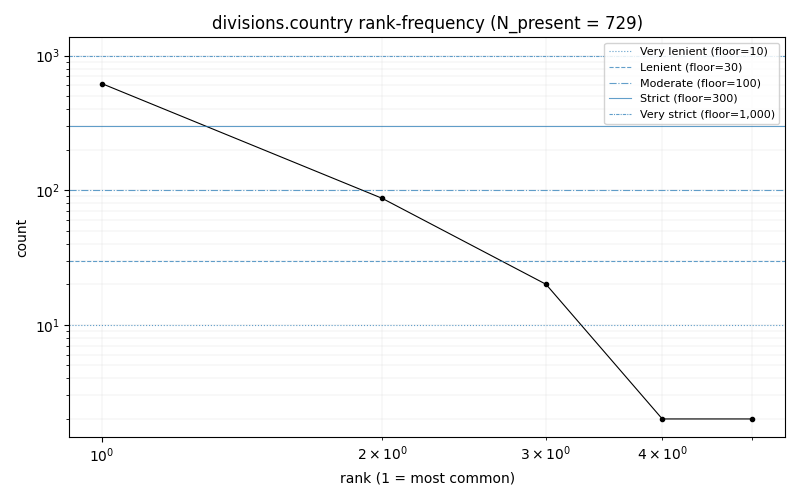

<!-- Auto-generated by scripts/analyse_singapore_frequencies.py
     Commit:        083b448bdb1f54ef4a21882eb76f123b918273d7
     Overture:      2026-04-15.0
     Run UTC:       2026-05-16T15:25:43Z
     Re-run reason: initial
     Do not edit by hand — edit the script and re-run. -->

# Phase 1 sub-B1 — Singapore frequency analysis

**Status: provisional. Floor strategies and per-field cuts derived from one region may shift when
Sweden is added. B2 should not freeze vocabulary on these numbers alone.**

## 1. Methodology

This report characterises categorical-field distributions across nine fields of five Overture themes
for region singapore at release 2026-04-15.0. The goal is to make Phase 1 vocabulary
decisions reviewable; B1 ships analysis only, no vocab YAML — that is B2's responsibility.

**Coverage definitions.** For scalar fields, `coverage` = fraction of rows whose value is non-null.
For `places.categories.alternate` (a list-of-strings column), `coverage` = fraction of rows whose
list is non-null *and* non-empty. The list-length distribution (in §3.8) uses the full theme row
count as the denominator, not the count of non-empty rows.

**Counting semantics.** Scalar fields contribute one count per non-null row.
For `categories.alternate`, each list element contributes one count, so `total_occurrences`
exceeds `n_present` and the
`% coverage retained` column uses `total_occurrences` as the denominator. The two denominators
differ; do not compare retention percentages across primary vs alternate naively.

**Floor strategies.** Effective floor per field is `max(percentage x N_present, hard_min)`. Five
named strategies span a ~100x pressure range (see §3 tables). Plots show horizontal threshold lines
at each strategy's effective floor for that field.

**Plot interpretation.** Log-log rank-frequency: x = rank (1 = most common), y = count. The shape
of the curve relative to threshold lines shows where natural cuts fall.

**Data source.** Overture release 2026-04-15.0, fetched via sub-project A's loader. Cache
manifest: `data/cache/overture/2026-04-15.0/singapore/manifest.yaml`.

## 2. Coverage summary

| Field | N_total | N_present | Coverage |
|---|---:|---:|---:|
| buildings.class | 339,972 | 75,240 | 22.13% |
| buildings.subtype | 339,972 | 76,985 | 22.64% |
| transportation.class | 202,334 | 202,292 | 99.98% |
| transportation.subclass | 202,334 | 46,317 | 22.89% |
| base.subtype | 8,636 | 8,636 | 100.00% |
| base.class | 8,636 | 8,636 | 100.00% |
| places.categories.primary | 149,657 | 145,774 | 97.41% |
| places.categories.alternate | 149,657 | 109,929 | 73.45% |
| divisions.country | 729 | 729 | 100.00% |

## 3. Field analyses

### 3.1 buildings.class

**Coverage:** 22.1% (75240 / 339972 rows present)

| Strategy | Effective floor | Total categories | Kept | Dropped | % coverage retained |
|---|---:|---:|---:|---:|---:|
| Very lenient | 10 | 62 | 42 | 20 | 99.91% |
| Lenient | 30 | 62 | 35 | 27 | 99.76% |
| Moderate | 100 | 62 | 22 | 40 | 98.83% |
| Strict | 300 | 62 | 15 | 47 | 97.03% |
| Very strict | 1,000 | 62 | 11 | 51 | 94.43% |

### 3.2 buildings.subtype

**Coverage:** 22.6% (76985 / 339972 rows present)

| Strategy | Effective floor | Total categories | Kept | Dropped | % coverage retained |
|---|---:|---:|---:|---:|---:|
| Very lenient | 10 | 13 | 12 | 1 | 100.00% |
| Lenient | 30 | 13 | 12 | 1 | 100.00% |
| Moderate | 100 | 13 | 11 | 2 | 99.92% |
| Strict | 300 | 13 | 9 | 4 | 99.52% |
| Very strict | 1,000 | 13 | 7 | 6 | 97.92% |

### 3.3 transportation.class

**Coverage:** 100.0% (202292 / 202334 rows present)

| Strategy | Effective floor | Total categories | Kept | Dropped | % coverage retained |
|---|---:|---:|---:|---:|---:|
| Very lenient | 10 | 21 | 19 | 2 | 100.00% |
| Lenient | 60 | 21 | 18 | 3 | 99.98% |
| Moderate | 202 | 21 | 17 | 4 | 99.93% |
| Strict | 606 | 21 | 15 | 6 | 99.58% |
| Very strict | 2,022 | 21 | 11 | 10 | 96.82% |

### 3.4 transportation.subclass

**Coverage:** 22.9% (46317 / 202334 rows present)

| Strategy | Effective floor | Total categories | Kept | Dropped | % coverage retained |
|---|---:|---:|---:|---:|---:|
| Very lenient | 10 | 7 | 7 | 0 | 100.00% |
| Lenient | 30 | 7 | 7 | 0 | 100.00% |
| Moderate | 100 | 7 | 7 | 0 | 100.00% |
| Strict | 300 | 7 | 7 | 0 | 100.00% |
| Very strict | 1,000 | 7 | 7 | 0 | 100.00% |

### 3.5 base.subtype

*Very strict floor binds to fewer than 4 categories on Singapore data; this row is shown for PRD §5 framing only and should not be selected as a Phase 1 cut.*

**Coverage:** 100.0% (8636 / 8636 rows present)

| Strategy | Effective floor | Total categories | Kept | Dropped | % coverage retained |
|---|---:|---:|---:|---:|---:|
| Very lenient | 10 | 11 | 9 | 2 | 99.90% |
| Lenient | 30 | 11 | 9 | 2 | 99.90% |
| Moderate | 100 | 11 | 7 | 4 | 98.46% |
| Strict | 300 | 11 | 6 | 5 | 97.17% |
| Very strict | 1,000 | 11 | 2 | 9 | 68.96% |

### 3.6 base.class

*Very strict floor binds to fewer than 4 categories on Singapore data; this row is shown for PRD §5 framing only and should not be selected as a Phase 1 cut.*

**Coverage:** 100.0% (8636 / 8636 rows present)

| Strategy | Effective floor | Total categories | Kept | Dropped | % coverage retained |
|---|---:|---:|---:|---:|---:|
| Very lenient | 10 | 23 | 15 | 8 | 99.63% |
| Lenient | 30 | 23 | 14 | 9 | 99.37% |
| Moderate | 100 | 23 | 8 | 15 | 96.50% |
| Strict | 300 | 23 | 7 | 16 | 95.31% |
| Very strict | 1,000 | 23 | 2 | 21 | 59.19% |

### 3.7 places.categories.primary

**Coverage:** 97.4% (145774 / 149657 rows present)

| Strategy | Effective floor | Total categories | Kept | Dropped | % coverage retained |
|---|---:|---:|---:|---:|---:|
| Very lenient | 10 | 1,235 | 724 | 511 | 98.85% |
| Lenient | 43 | 1,235 | 421 | 814 | 94.33% |
| Moderate | 145 | 1,235 | 221 | 1,014 | 83.10% |
| Strict | 437 | 1,235 | 82 | 1,153 | 59.11% |
| Very strict | 1,457 | 1,235 | 15 | 1,220 | 25.14% |

### 3.8 places.categories.alternate

**Coverage:** 73.5% (109929 / 149657 rows present)

**List-length distribution** (denominator = all rows of theme):

| List length | Count | % of all rows |
|---|---:|---:|
| 0 | 39,728 | 26.55% |
| 1 | 43,488 | 29.06% |
| 2 | 64,482 | 43.09% |
| 3 | 598 | 0.40% |
| 4 | 401 | 0.27% |
| 5+ | 960 | 0.64% |

| Strategy | Effective floor | Total categories | Kept | Dropped | % coverage retained |
|---|---:|---:|---:|---:|---:|
| Very lenient | 10 | 1,281 | 781 | 500 | 99.09% |
| Lenient | 32 | 1,281 | 512 | 769 | 96.51% |
| Moderate | 109 | 1,281 | 267 | 1,014 | 88.36% |
| Strict | 329 | 1,281 | 126 | 1,155 | 73.68% |
| Very strict | 1,099 | 1,281 | 31 | 1,250 | 44.05% |

### 3.9 divisions.country

*Very strict floor binds to fewer than 4 categories on Singapore data; this row is shown for PRD §5 framing only and should not be selected as a Phase 1 cut.*

**Coverage:** 100.0% (729 / 729 rows present)

| Strategy | Effective floor | Total categories | Kept | Dropped | % coverage retained |
|---|---:|---:|---:|---:|---:|
| Very lenient | 10 | 5 | 3 | 2 | 99.45% |
| Lenient | 30 | 5 | 2 | 3 | 96.71% |
| Moderate | 100 | 5 | 1 | 4 | 84.77% |
| Strict | 300 | 5 | 1 | 4 | 84.77% |
| Very strict | 1,000 | 5 | 0 | 5 | 0.00% |

## 4. Implications for B2 (provisional)

- **Missing-value handling.** B1 does not decide. Three options for B2:
  - emit `<unknown>` token for missing-class rows;
  - drop missing-class features from training entirely;
  - infer class from context (geometry, neighbouring features).
- **Per-field floor selection.** B2 picks one strategy per field from §3's lattice (or computes
  a hybrid). Strategies flagged as PRD-framing-only should not be picked unless intentional.
- **`places.categories.alternate` max-alternates cap.** Decision input is the list-length
  distribution in §3.8. B1 does not propose a cap.
- **All B2 decisions are provisional pending Sweden.** Re-run B1 against Sweden when sub-A's
  cold-fetch issue is resolved and a Swedish cache exists.

## 5. Reproducibility

- Overture release: `2026-04-15.0`
- Cache manifest: `data/cache/overture/2026-04-15.0/singapore/manifest.yaml`
- Per-theme cache sha256s:
  - base: `b920ba42aa55f496d83af95c15554dc496afb8a6a876334d958938b87fa3fee9`
  - buildings: `3421f87d0c60c3023d532343fd44f1b77fb17dadd65592995db75562bb9a381b`
  - divisions: `5058641621f173408c75310cdc3202d57f065e8f86d01a63ea5a4c2655afaf2d`
  - places: `a68c02c740438e5e5e52a689a84a5d1043aa3266ab78311345964e4e1175b932`
  - transportation: `81635d104749e5b1492984e4339df59a9d86d751a9a7cd0a0410af47a82e2432`
- Code commit: `083b448bdb1f54ef4a21882eb76f123b918273d7`
- Run timestamp (UTC): `2026-05-16T15:25:43Z`
- Re-run reason: `initial`
- Generated by: `scripts/analyse_singapore_frequencies.py`
